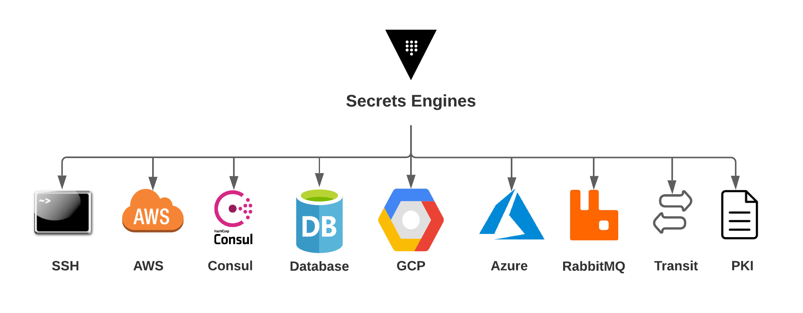

# Terraform Module: Vault Secrets Engine

A Terraform module to enable and configure Vault secrets engines.

## Overview



This module supports the following Vault Secrets Engines:

   - AWS
   - Azure
   - GCP
   - Consul
   - Transit
   - Database
   - PKI
   - SSH
   - RabbitMQ
   

## Requirements
This module requires Terraform version 0.13.0 or newer and an accessible Vault instance.

The Vault token used by Terraform will need the following Vault policy:

``` shell script
path "sys/mount*" {
  capabilities = ["create","read","update","delete","list"]
}
```

## Usage

```shell script
module "secrets_engines" {
  source = "github.com/devops-rob/terraform-vault-secrets-engines"

  secrets_engines = [
    "aws",
    "consul"
  ] 

  # AWS config
  aws_backend_role_name = "test"
  aws_iam_groups        = ["test"]
  
  # Consul config
  consul_token             = "acl-token"
  consul_backend_role_name = "test"

  consul_policies = [
    "test-policy",
    "test-policy-2"
  ]
}
```

## License

Licensed under the Apache License, Version 2.0 (the "License").

You may obtain a copy of the License at [apache.org/licenses/LICENSE-2.0](http://www.apache.org/licenses/LICENSE-2.0).

Unless required by applicable law or agreed to in writing, software distributed under the License is distributed on an _"AS IS"_ basis, without WARRANTIES or conditions of any kind, either express or implied.

See the License for the specific language governing permissions and limitations under the License.